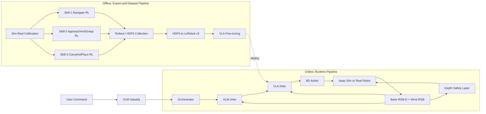
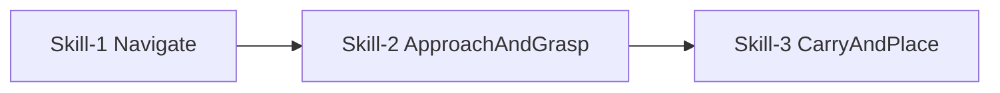
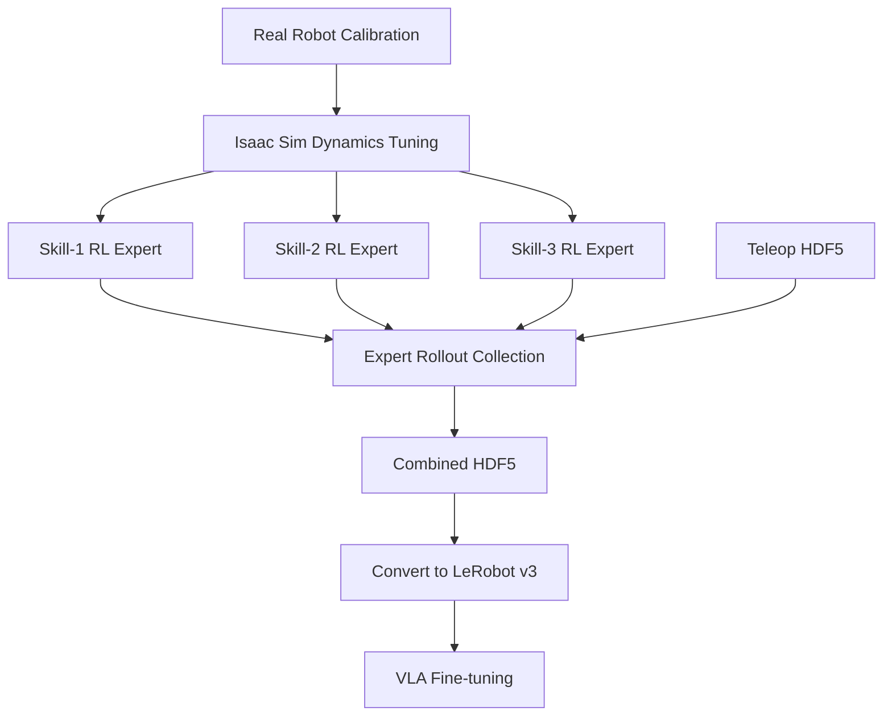
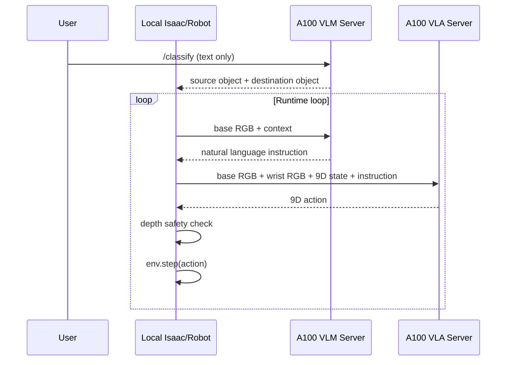
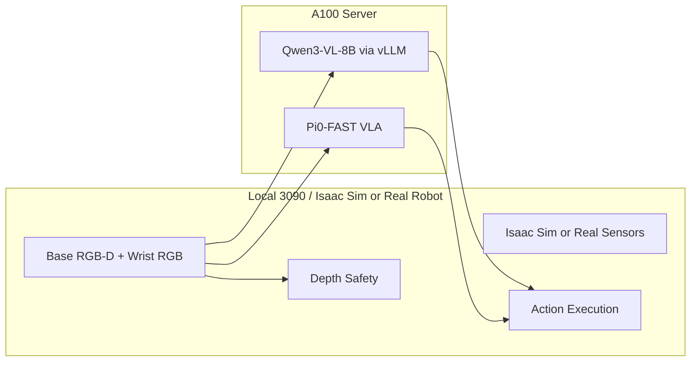

# LeKiwi VLM+VLA 통합 파이프라인 요약

이 문서는 아래 자료를 합쳐서, 현재 LeKiwi 프로젝트의 전체 파이프라인을 한눈에 볼 수 있게 재정리한 요약본이다.

- `pipeline_new/1_전체_파이프라인.md`
- `pipeline_new/2_Sim_데이터_수집_파이프라인.md`
- `pipeline_new/3_코드_현황_정리.md`
- `pipeline_new/server_guide.md`
- `vllm/README.md`

---

## 1. 한 줄 요약

LeKiwi 파이프라인은 다음 두 축으로 구성된다.

1. **오프라인 학습 파이프라인**
   - sim에서 skill별 expert를 만들고
   - 대량 rollout을 수집해
   - VLA가 학습할 dataset으로 변환한 뒤
   - 최종적으로 VLA policy를 파인튜닝한다.

2. **온라인 실행 파이프라인**
   - VLM이 현재 상황을 보고 **무엇을 할지(what)**를 결정하고
   - VLA가 카메라와 state를 보고 **어떻게 움직일지(how)**를 9D action으로 출력한다.

---

## 2. 전체 구조



---

## 3. 오프라인 파이프라인

### 3-1. 목표

오프라인 파이프라인의 목적은, 최종적으로 VLA가 학습할 수 있는 고품질의 `(이미지, instruction, state, action)` 데이터를 만드는 것이다.

핵심 전략은 다음과 같다.

- 사람 텔레옵만으로는 데이터가 부족하므로, **sim expert rollout**을 대량 생산한다.
- expert는 한 개의 거대한 end-to-end policy가 아니라, **3개의 skill policy**로 분리한다.
- 이후 rollout을 LeRobot v3 형식으로 변환해 VLA 파인튜닝에 사용한다.

### 3-2. Skill 분해



각 skill의 역할은 다음과 같다.

- **Skill-1 Navigate**
  - 물체가 있는 방향으로 베이스를 이동
  - 장애물을 피하면서 도달
- **Skill-2 ApproachAndGrasp**
  - 물체 가까이 접근
  - 팔과 베이스를 함께 제어하며 파지
- **Skill-3 CarryAndPlace**
  - 물체를 들고 이동
  - destination object 옆에 안정적으로 배치

### 3-3. 학습 및 데이터 생산 흐름



### 3-4. 주요 스크립트

| 단계 | 대표 스크립트 |
|------|---------------|
| Sim-real calibration | `calibrate_real_robot.py`, `tune_sim_dynamics.py`, `replay_in_sim.py` |
| Skill-1 RL | `lekiwi_skill1_env.py`, `train_lekiwi.py` |
| Skill-2 RL | `lekiwi_skill2_env.py`, `train_resip.py`, `eval_resip.py` |
| Skill-3 RL | `lekiwi_skill3_env.py`, `train_lekiwi.py` |
| 텔레옵 기록 | `record_teleop.py` (평면), `vllm/record_teleop_scene.py` (ProcTHOR scene) |
| Expert data 수집 | `collect_demos.py`, `collect_resip_demos.py`, `generate_expert_data.py` |
| Dataset 변환 | `convert_hdf5_to_lerobot_v3.py` |
| VLA 파인튜닝 | `train_bc.py`, `train_act_bc.py`, `train_diffusion_bc.py`, LeRobot 기반 VLA 학습 |
| Scene 환경 | `vllm/procthor_scene.py`, `vllm/validate_scene_layout.py` |
| VLM+VLA 통합 실행 | `vllm/run_full_task.py` (ProcTHOR scene + VLM + VLA) |

---

## 4. 온라인 실행 파이프라인

### 4-1. 핵심 개념

온라인 파이프라인의 핵심은 **VLM은 상위 오케스트레이터**, **VLA는 저수준 제어기**라는 점이다.

- **VLM**
  - 사용자 명령을 파싱한다.
  - 현재 이미지를 보고 지금 해야 할 행동을 자연어로 지시한다.
- **VLA**
  - 카메라 이미지와 9D state를 바탕으로 실제 9D action을 예측한다.

### 4-2. 실행 흐름



### 4-3. 9D state / 9D action

현재 프로젝트에서 VLA가 사용하는 state/action 포맷은 다음 순서를 따른다.

```text
[arm5, gripper1, base3]
= [arm_shoulder_pan,
   arm_shoulder_lift,
   arm_elbow_flex,
   arm_wrist_flex,
   arm_wrist_roll,
   arm_gripper,
   x.vel, y.vel, theta.vel]
```

즉:

- arm joint position 5D
- gripper position 1D
- base velocity 3D

로 구성된다.

### 4-4. 서버/로컬 역할 분담



정리하면:

- **로컬**
  - Isaac Sim 실행 또는 실제 로봇 센서 읽기
  - 이미지 획득
  - VLA action 적용
  - depth safety 수행
- **서버**
  - VLM 추론 (vLLM + Qwen3-VL-8B, ~29.8GB)
  - VLA 추론 (Pi0-FAST 2.9B via lerobot 0.5.0, ~8.1GB)

### 4-5. ProcTHOR Scene 환경

Sim Full-System 평가와 VLA 파인튜닝 데이터 수집에는 ProcTHOR scene (MolmoSpaces USD)을 사용한다.

- **scene_scale=0.6**: scene USD를 60%로 축소. 로봇/물체는 원본 스케일 유지 (entity_scale=1.0 필수 — 카메라 호환)
- **CPU PhysX**: GPU PhysX는 scene static collider↔articulation 충돌 미지원
- **Object spawn**: scene 내 빈 바닥 구역에서 rejection sampling (최대 2000회)
- **검증 결과** (2026-03-13): 5.6Hz (VLM ~197ms 비동기 + VLA 26-33ms 동기), scene 내 벽/가구 충돌 정상

### 4-6. Scene 데이터 수집

`vllm/record_teleop_scene.py`로 ProcTHOR scene에서 VLA 파인튜닝용 데이터를 수집한다. HDF5 출력은 `convert_hdf5_to_lerobot_v3.py`로 LeRobot v3 변환 후 Pi0-FAST 파인튜닝에 사용한다.

#### 현재 데이터셋 (lekiwi_viva_v2, 2026-04-05)

| Skill | 에피소드 | Steps/ep | Instruction | 수집 방법 |
|-------|---------|---------|-------------|----------|
| Approach & Lift | 100 | ~700 | "approach and lift the medicine bottle" | RL expert (BC+ResiP) |
| Navigate | 446 | 150 | 6방향 (navigate forward/backward/...) | Lookup table (고정 방향×위치) |
| Carry | 432 | 150 | 6방향 (carry forward/backward/...) | RL expert (BC+ResiP, S3 phase only) |
| **합계** | **978** | — | 18 tasks | `viva_merged_with_carry.hdf5` |

- Carry는 `--skill combined_s2_s3`로 수집: S2 expert가 lift → S3 BC+ResiP가 carry. **S3 phase만 기록**
- Navigate/Carry는 150 steps로 동일 (편향 방지)
- 9개 anomalous ep 삭제, last frame state=0 수정, stats std floor=0.3 적용

---

## 5. 논문/발표용으로 가장 중요한 그림 2개

### Figure A. 전체 시스템 개요

논문 본문에는 아래 개념을 담은 그림이 가장 중요하다.

```text
User Command
   -> VLM (task understanding + orchestration)
   -> VLA (instruction-conditioned visuomotor policy)
   -> Mobile Manipulator (base + arm + gripper)
   -> Environment
```

이 그림의 메시지는:

- 우리 시스템은 단일 policy가 아니라
- **상위 판단(VLM)** 과 **저수준 제어(VLA)** 를 분리했고
- 이를 **mobile manipulation**에 적용했다는 점이다.

### Figure B. 학습 데이터 생산 파이프라인

두 번째로 중요한 그림은 다음이다.

```text
Calibration
 -> Skill-wise RL experts
 -> Large-scale rollout collection
 -> HDF5 aggregation
 -> LeRobot v3 conversion
 -> VLA fine-tuning
```

이 그림의 메시지는:

- 데이터셋을 수동 수집한 것이 아니라
- **sim expert 생성 → rollout 수집 → dataset 변환 → VLA 학습**
로 이어지는 체계적 파이프라인이라는 점이다.

---

## 6. 본 프로젝트에서 강조할 차별점

이 파이프라인의 차별점은 아래 네 가지다.

1. **Mobile manipulation**
   - 고정 매니퓰레이터가 아니라, 베이스 이동과 팔 조작이 동시에 일어난다.

2. **3-skill decomposition**
   - Navigate, ApproachAndGrasp, CarryAndPlace로 나누어 expert를 학습한다.

3. **Sim-to-VLA distillation**
   - RL expert를 직접 배포하는 것이 아니라, rollout을 모아 VLA 학습 데이터로 distill한다.

4. **VLM + VLA hierarchy**
   - VLM이 상위 계획과 상황판단을 담당하고, VLA가 저수준 제어를 담당한다.

---

## 7. 짧은 발표용 요약 문장

아래 문장은 발표 슬라이드나 논문 초반 요약에 바로 쓸 수 있다.

> We build a hierarchical mobile manipulation system where a VLM performs task understanding and high-level orchestration, while a VLA executes low-level visuomotor control. Skill-wise RL experts in simulation generate large-scale rollout data, which is converted into a VLA training dataset and distilled into a deployable policy.

---

## 8. 추천 사용 방식

이 문서는 두 가지 용도로 바로 쓸 수 있다.

1. **논문/발표 초안용**
   - Figure A, Figure B를 기반으로 도식화
2. **팀 내부 공통 참조 문서**
   - 오프라인 학습과 온라인 실행의 연결 구조를 빠르게 설명할 때 사용

